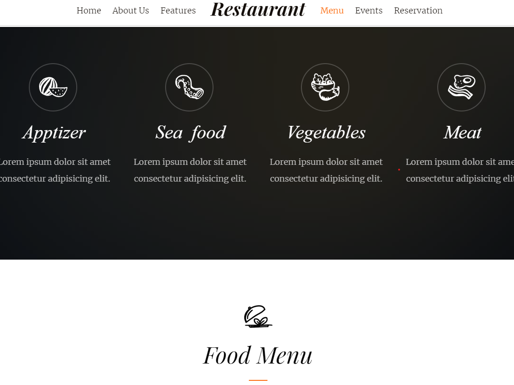

# Website Template for Restaurant

    

## About This Portfolio/Project Details

About This project and the reference link in this repo are for anyone who is interested in working to enter developer world to produce high quality, working style! Check out follow reference link if you think it is interested.

**Project Link:** [Restaurant Business Template](https://bdfdportfolio.tk/Website01_Restaurant/)

## Project Details

The Project Page enlisted as follows:

- [x] **P1-Restaurant Landing Page**
  - [x] **S1-Home Section**
  - [x] **S2-About Us Section**
  - [x] **S3-Feature Section**
  - [x] **S4-Menu Section**
  - [x] **S5-Events Section**
  - [x] **S6-Reservation Section**

## Project Description:

 

## Tools Used In This Project

**Tools:** GitHub, Visual Studio Code Editor

**Libraries:** HTML, CSS, and JavaScript

**Projects:** Restaurant Business Template

**Reference:**  
Demo: <a href="https://bdfdportfolio.tk/Website01_Restaurant/">Demo Website Link</a>  
Reference:

- <a href="https://github.com/BDFDPortfolio/Website01_Restaurant">Orginal Data Source Link</a>

Credit:

- <a href="http://getbootstrap.com/">Bootstrap</a>
- <a href="https://github.com/Eonasdan/bootstrap-datetimepicker">Bootstrap DateTimePicker</a>
- <a href="http://jquery.com/">jQuery</a>
- <a href="http://gsgd.co.uk/sandbox/jquery/easing/">jQuery Easing</a>
- <a href="http://modernizr.com/">Modernizr</a>
- <a href="https://www.google.com/fonts/">Google Fonts</a>
- <a href="https://icomoon.io/app/">Icomoon</a>
- <a href="https://github.com/thesabbir/simple-line-icons">Simple Line Icons</a>
- <a href="https://github.com/scottjehl/Respond/blob/master/LICENSE-MIT">Respond JS</a>
- <a href="https://github.com/imakewebthings/waypoints/blog/master/licenses.txt">jQuery Waypoint</a>
- <a href="http://markdalgleish.com/projects/stellar.js/">Stellar Parallax</a>
- <a href="http://pexels.com">Demo Images</a>
- <a href="handdrawngoods.com/store/tasty-icons-free-food-icons/">Icon Images Hand-drawn</a>

   

### Thanks For Watch This Repositories!

### <i>KEEP AWESOME & STAY COOL!</i>

### Feel Free To Fork And Report If You Find Any Issue :)

